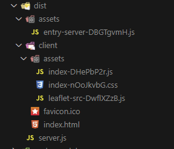

# vue-ssr-search-test

Поиск локаций с использованием Nominatim API.

<div align="center">
    
</div>

## Краткое описание реализации

В данном проекте серверный рендеринг (**SSR**) реализован с использованием **Node** + **Express.js**, без сторонних библиотек.

Для демонстрации корректной работы серверного рендеринга и процесса гидратации на клиентской стороне добавлено несколько страниц c помощью **Vue Router**.

Для управления состоянием приложения используется **Pinia**

Для визуализации результатов поиска было решено подключить библиотеку **Leaflet**.
Поскольку Leaflet функционирует исключительно в браузере, обеспечен динамический импорт данной библиотеки в хуке `onMounted()` Vue. Это решение гарантирует, что библиотека будет загружена только на клиентской стороне, избегая ошибок, связанных с отсутствием глобального объекта `window` на сервере.

## Подготовка проекта

```sh
npm install
```

### Запуск приложения в режиме Hot-Reload для разработки

```sh
npm run dev
```

### Сборка готового решения

```sh
npm run build
```

### Сборка и запуск production-версии

```sh
npm run preview
```

#### Структура готового проекта:

<div align="left">
    
</div>
